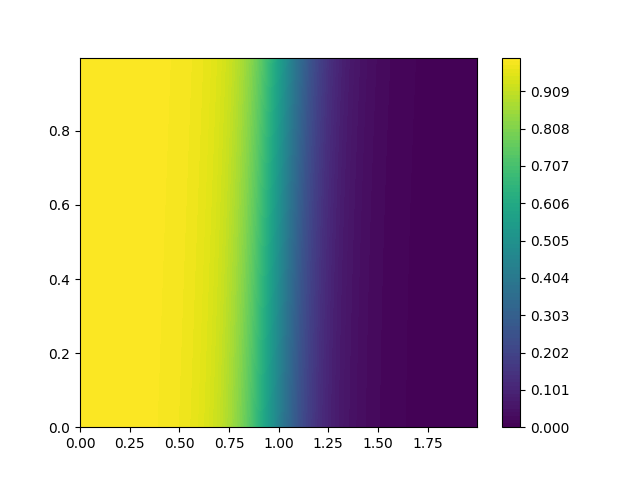
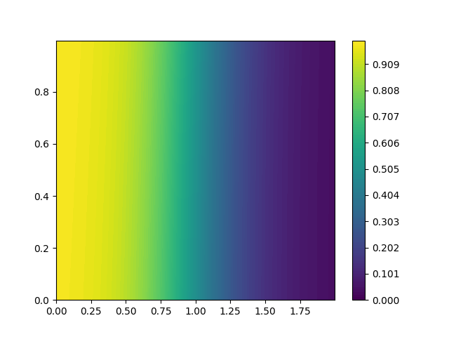
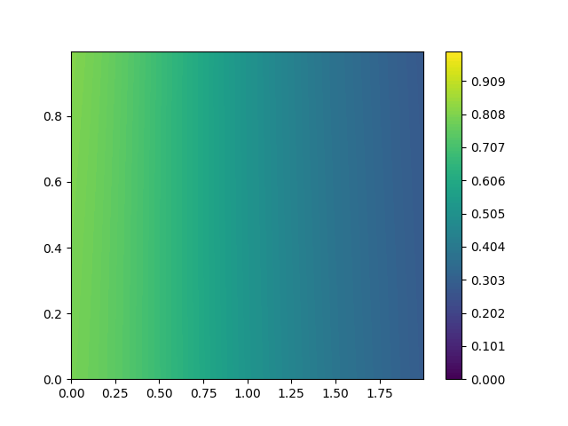
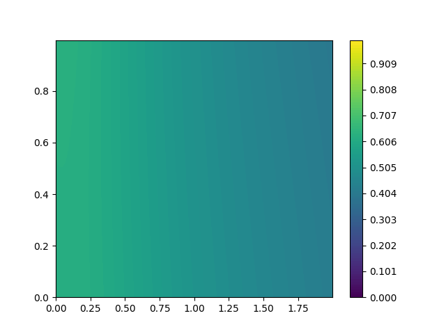
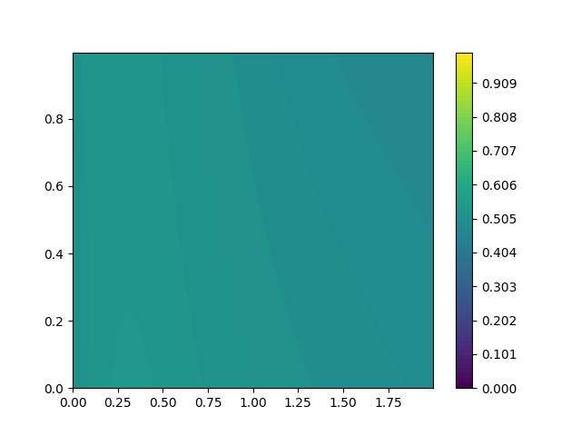
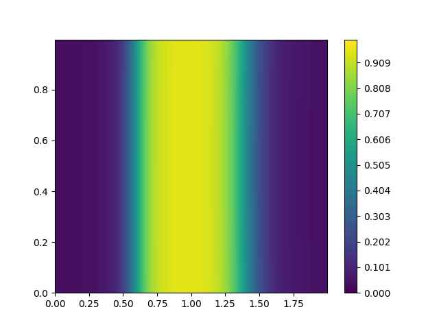
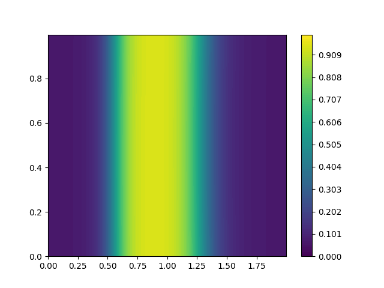

# Physics-Informed Neural Networks (PINNs) for Thermal Diffusion

This repository implements Physics-Informed Neural Networks (PINNs) to solve thermal diffusion problems. PINNs are neural networks trained to approximate solutions of partial differential equations (PDEs), while optionally leveraging measurement data. They encode both the physics and observed information in a single training objective. 

# Project
The goal of this project is to approximate a physical field $u(x,t)$ using a neural network $f(x,t)$. The results are:

<p float="left">
  
  
  
  
  
</p>

<p float="left">
  
  
  
  
  
</p>


## Loss Functions

### Data Loss
The **data loss** measures the error of the network with respect to observed measurements or imposed initial/boundary conditions.  
Given a set of measurement points \((x_i, t_i, u_i)\) for \(i = 1, \dots, n\), the data loss is the Mean Squared Error (MSE) between the predicted value \(f(x_i, t_i)\) and the observed value \(u_i\):  

$$
\text{MSE}_u = \frac{1}{n} \sum_{i=1}^n \| f(x_i, t_i) - u_i \|^2
$$

## Physics Loss
The **physics loss** enforces the network to satisfy the governing Partial Differential Equation (PDE).  
A PDE can be written in terms of a differential operator \(\mathcal{N}\) as:  

$$
\frac{\partial u}{\partial t} + \mathcal{N}[u] = 0
$$

For the 2D heat equation, the operator is:  

$$
\mathcal{N}[u] = - D \left( \frac{\partial^2 u}{\partial x^2} + \frac{\partial^2 u}{\partial y^2} \right)
$$

We evaluate the physics loss on a set of collocation points \((x_k, t_k)\) for \(k = 1, \dots, N\) to enforce the PDE:  

$$
\text{MSE}_\phi = \frac{1}{N} \sum_{k=1}^N \left\| \frac{\partial f}{\partial t}(x_k, t_k) + \mathcal{N}[f](x_k, t_k) \right\|^2
$$

> Note: Derivatives are computed automatically using PyTorch **autograd**, avoiding numerical differencing.

### Total Loss
The total loss minimized during training is the sum of data and physics losses:  

$$
\text{MSE}_{\text{total}} = \text{MSE}_u + \text{MSE}_\phi
$$

## Boundary and Initial Conditions

Boundary and initial conditions are incorporated into the data loss ($\text{MSE}_u$) to constrain the solution:

* **Initial Condition:**
    $$T(x, y, 0) = T_0(x, y)$$

* **Neumann Boundary Condition** (zero thermal flux):
    $$\nabla T \cdot \mathbf{n} = 0 \quad \text{(on the boundary)}$$
    where $\mathbf{n}$ is the outward normal vector.

* **Final Condition** (homogeneous steady state):
    $$T(x, y, t \to \infty) = T_f$$

## Optional
- **Standard PINN Loss**: Includes initial, boundary, and physics terms.  
- **Fourier Loss**: Optionally guides training with an analytical Fourier-based solution.  

For validation and comparison, the solution can also be computed via **Fourier series decomposition**, serving as a ground truth baseline to evaluate the accuracy of the PINN.

# How to run
To run, simply write
```bash
python main.py --train --method [normal, fourier]
```
You can either select to train or just do inference using the flag `--train`. You can choose the method by using `--method` and select `normal` (default) or `fourier` method.  
